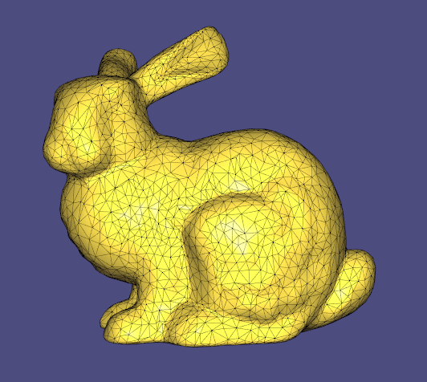
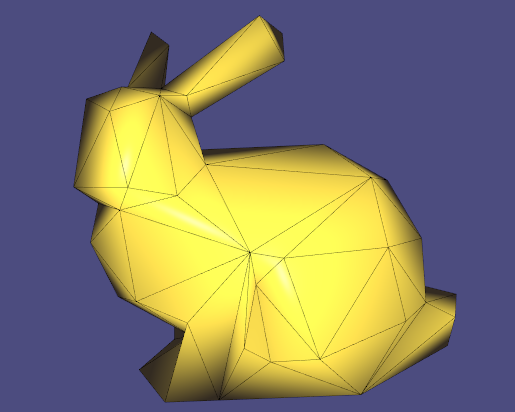

# csc2521 Surface Simplification Implementation

This repo was setup by cloning: https://github.com/libigl/libigl-example-project

This is an implementation of the paper:

Michael Garland and Paul S. Heckbert. 1998. Simplifying surfaces with color and texture using quadric error metrics. In Proceedings of the conference on Visualization '98 (VIS '98). IEEE Computer Society Press, Los Alamitos, CA, USA, 263-269.

I am using libigl to handle mesh loading, rendering, and other geometry stuff, but am not using any functions that implement a crucial part of the algorithm described in the paper. I am setting this restriction on myself for the sake of learning.

__Reference Stanford Bunny__

__Using Reduced Subset Placement Bunny__

